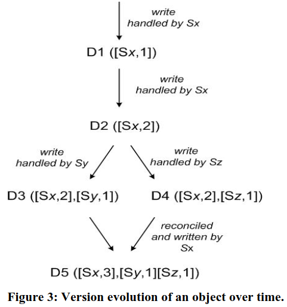

# Amazon Dynamo Paper Notes

- [Read the paper: Dynamo: Amazon’s Highly Available Key-value Store](https://www.allthingsdistributed.com/files/amazon-dynamo-sosp2007.pdf)

### Chapter 2.3: Design Considerations

- When perform the process of resolving update conflicts:
    - at read time:
      - Dynamo choice
      - writes are never rejected 
    - at write time:
      - keep the reads operation simple
      - writes may be rejected if the data store cannot reach all (or a majority of) the replicas at a given time  

- Who performs the process of conflict resolution:
  - data store:
    - can only use simple policies (e.g. last write wins)
  - application:   
    - since the application is aware of the data schema it can decide on the conflict resolution method that is best suited for its client’s experience

- Other key principles embraced in the design are:
  - Incremental scalability
  - Symmetry
  - Decentralization
  - Heterogeneity

## Chapter 4: System Architecture

### 4.1: System Interface

- Dynamo stores objects associated with a key through a simple interface.
- It exposes two operations: `get()` and `put()`.

- **`get(key)` Operation**
  - Locates object replicas associated with the key in the storage system.
  - It returns a single object or a list of objects with conflicting versions along with a context.

- **`put(key, context, object)` Operation**
  - Determines the placement of object replicas based on the associated key.
  - It writes the replicas to disk.
  - The context encodes system metadata about the object, including the version, and is stored along with the object. Is used for verifying the validity of the context object supplied in the put request.

## 4.2: Partitioning Algorithm

- Dynamo uses a partitioning scheme based on consistent hashing.
- Each node in the system is assigned a random position on a ring.
- Each data item is assigned to a node by hashing the item's key and walking the ring clockwise to find the first node with a position larger than the item's position.
- To address non-uniform data and load distribution, Dynamo uses a variant of consistent hashing where each node is assigned to multiple points on the ring. This is done using the concept of "virtual nodes".
- Virtual nodes have the following advantages:
  - If a node becomes unavailable, the load is evenly distributed across the remaining nodes.
  - When a node becomes available again, or a new node is added to the system, the new node accepts a roughly equivalent amount of load from each of the other nodes.
  - The number of virtual nodes that a node is responsible for can be decided based on its capacity, accounting for heterogeneity in the physical infrastructure.

## 4.3: Replication

- Each data item is replicated at N hosts, where N is a parameter configured "per-instance".
- Each key, k, is assigned to a coordinator node.
- The coordinator is responsible for the replication of the data items that fall within its range.
- The coordinator replicates these keys at the N-1 clockwise successor nodes in the ring.
- Each node is responsible for the region of the ring between it and its Nth predecessor.
- The list of nodes that is responsible for storing a particular key is called the preference list.
- The preference list contains more than N nodes to account for node failures.
- Virtual nodes are used to ensure that the preference list contains only distinct physical nodes.

**Additional notes:**

- The preference list is used to determine which nodes to read from and write to when performing operations on a key.
- The coordinator node is responsible for coordinating the replication of updates to a key.
- If a node fails, the preference list is updated to exclude the failed node.
- The system is designed to ensure that data is always available, even if multiple nodes fail.

## 4.4: Data Versioning

- Dynamo provides eventual consistency, which means that updates may not be propagated to all replicas immediately.
- To handle concurrent updates, Dynamo uses vector clocks to track the causal relationships between different versions of the same object.
- Vector clocks allow Dynamo to determine which version of an object is authoritative and which versions are obsolete.
- When a client updates an object, it must specify which version it is updating.
- If Dynamo has multiple versions of an object that cannot be reconciled syntactically, it will return all of the versions to the client for semantic reconciliation.
- To prevent vector clocks from growing too large, Dynamo employs a clock truncation scheme that removes the oldest (node, counter) pairs from the clock when the number of pairs reaches a threshold.

**Additional notes:**

- Semantic reconciliation is the process of merging multiple versions of an object into a single version. This is typically done by the client application.
- Dynamo's eventual consistency model is suitable for applications that can tolerate some inconsistencies in the data, such as shopping carts and product catalogs.
- Dynamo's versioning mechanism allows for complex conflict resolution scenarios to be handled by the client application.

## 4.5: Execution of get() and put() Operations

- Any storage node in Dynamo can receive client get and put operations for any key.
- Clients can use either a generic load balancer or a partition-aware client library to select a node.
- The node that receives a request is known as the coordinator.
- Read and write operations involve the first N healthy nodes in the preference list.
- Dynamo uses a consistency protocol similar to those used in quorum systems to maintain consistency among its replicas.
- The latency of a get (or put) operation is dictated by the slowest of the R (or W) replicas.
- R and W are usually configured to be less than N to provide better latency.

**Additional notes:**

- The coordinator generates the vector clock for the new version when writing a new value to a key.
- The coordinator sends the new version to the N highest-ranked reachable nodes.
- If at least W-1 nodes respond, the write is considered successful.
- For a get operation, the coordinator requests all existing versions of the data for that key from the N highest-ranked reachable nodes.
- The coordinator waits for R responses before returning the result to the client.
- If the coordinator gathers multiple versions of the data, it returns all the versions it deems to be causally unrelated.
- The divergent versions are then reconciled, and the reconciled version is written back.

**Example:**

Suppose we have a Dynamo cluster with 10 nodes and a preference list of 5 nodes for a particular key. We also have R and W set to 3.

- If a client performs a put operation on this key, the coordinator will send the new version to the 5 highest-ranked reachable nodes. If at least 2 of these nodes respond, the write is considered successful.

- If a client performs a get operation on this key, the coordinator will request all existing versions of the data from the 5 highest-ranked reachable nodes. The coordinator will wait for 3 responses before returning the result to the client.

- If the coordinator gathers multiple versions of the data, it will return all the versions it deems to be causally unrelated. The divergent versions will then be reconciled, and the reconciled version will be written back.

## 4.6: Handling Failures: Hinted Handoff

- DynamoDB uses a "sloppy quorum" approach to read and write operations, which means that it does not enforce strict quorum membership.
- Instead, it performs all read and write operations on the first N healthy nodes from the preference list, which may not always be the first N nodes encountered while walking the consistent hashing ring.
- This is done to maintain availability and durability guarantees in the face of temporary node or network failures.
- If a node is unavailable during a write operation, the replica will be sent to another node in the preference list. This replica will have a hint in its metadata that suggests which node was the intended recipient.
- When the unavailable node recovers, the node that received the hinted replica will attempt to deliver it.
- Applications that need the highest level of availability can set W to 1, which ensures that a write is accepted as long as a single node in the system has durably written the key to its local store.
- DynamoDB is configured such that each object is replicated across multiple data centers. This allows it to handle entire data center failures without a data outage.

## 4.7: Handling Permanent Failures: Replica Synchronization

- Hinted handoff works best when system membership churn is low and node failures are transient.
- To handle scenarios where hinted replicas become unavailable before they can be returned to the original replica node, Dynamo implements an anti-entropy protocol to keep replicas synchronized.
- Dynamo uses Merkle trees to detect inconsistencies between replicas faster and to minimize the amount of transferred data.
- Each node maintains a separate Merkle tree for each key range it hosts.
- Two nodes exchange the root of the Merkle tree corresponding to the key ranges that they host in common
- Using a tree traversal scheme, the nodes determine if they have any differences and perform the appropriate synchronization action.
- The disadvantage of this scheme is that many key ranges change when a node joins or leaves the system, requiring the tree(s) to be recalculated.

## 4.8: Membership and Failure Detection
### 4.8.1: Ring Membership
- DynamoDB uses an explicit mechanism to initiate the addition and removal of nodes from the ring.
- An administrator uses a command line tool or browser to issue a membership change to join a node to the ring or remove a node from the ring.
- The membership changes are persisted to disk and propagated via a gossip-based protocol.
- When a node starts for the first time, it chooses its set of tokens and maps nodes to their respective token sets.
- The mappings are stored at different DynamoDB nodes and reconciled during the same communication exchange that reconciles the membership change histories.
- This allows each node to be aware of the token ranges handled by its peers and to forward a key's read/write operations to the right set of nodes directly.

### 4.8.2: External Discovery
- The mechanism for adding and removing nodes from the ring could temporarily result in a logically partitioned ring.
- To prevent this, some DynamoDB nodes play the role of seeds.
- Seeds are nodes that are discovered via an external mechanism and are known to all nodes.
- All nodes eventually reconcile their membership with a seed, making logical partitions highly unlikely.
- Seeds can be obtained either from static configuration or from a configuration service.
- Typically, seeds are fully functional nodes in the DynamoDB ring.

### 4.8.3: Failure Detection
- DynamoDB uses a purely local notion of failure detection to avoid attempts to communicate with unreachable peers.
- This means that a node will consider another node failed if it does not respond to its messages, even if the other node is responsive to other nodes.
- In the presence of a steady rate of client requests, a node will quickly discover that another node is unresponsive and will use alternate nodes to service requests that map to the failed node's partitions.
- In the absence of client requests, nodes do not need to know whether other nodes are reachable and responsive.
- Early designs of Dynamo used a decentralized failure detector to maintain a globally consistent view of failure state, but this was later determined to be unnecessary due to the use of explicit node join and leave methods.

## 4.9: Adding/Removing Storage Nodes
- When a new node is added to the system, it is assigned a number of tokens that are randomly scattered on the ring.
- For every key range that is assigned to the new node, there may be a number of existing nodes that are currently responsible for handling keys that fall within that token range.
- The existing nodes transfer those keys to the new node.
- When a node is removed from the system, the reallocation of keys happens in the reverse process.
- This approach distributes the load of key distribution uniformly across the storage nodes, which is important for meeting latency requirements and ensuring fast bootstrapping.
- A confirmation round is used between the source and destination nodes to ensure that the destination node does not receive any duplicate transfers for a given key range.

**Additional notes:**

- The process of transferring keys from existing nodes to a new node is called bootstrapping.
- DynamoDB uses a gossip protocol to propagate information about new nodes to all nodes in the system.
- When a new node receives information about a new node, it contacts the new node to coordinate the transfer of keys.
- The transfer of keys is done in a way that minimizes disruption to the system.

## Chapter 5: Implementation

- DynamoDB has three main software components: request coordination, membership and failure detection, and a local persistence engine.
- The local persistence engine can be plugged in, and the default engine is Berkeley Database Transactional Data Store.
- The request coordination component is built on an event-driven messaging substrate and uses Java NIO channels.
- For each client request, a state machine is created to identify the nodes responsible for the key, send the requests, wait for responses, and process the replies.
- After the read response has been returned to the caller, the state machine waits for a small period of time to receive any outstanding responses and updates any nodes that returned stale versions.
- Write requests are coordinated by one of the top N nodes in the preference list.
- To improve load distribution and performance, the coordinator for a write is chosen to be the node that replied fastest to the previous read operation.

**Additional notes:**

- The SEDA architecture (Staged Event-Driven Architecture) is a design pattern for distributed systems that uses a series of stages to process events. This approach helps to improve performance and scalability.
- The read repair mechanism helps to ensure that replicas are consistent by repairing replicas that have missed a recent update.
- The "read-your-writes" consistency model guarantees that a client will always see the latest value that it wrote, even if the write has not yet been replicated to all nodes.